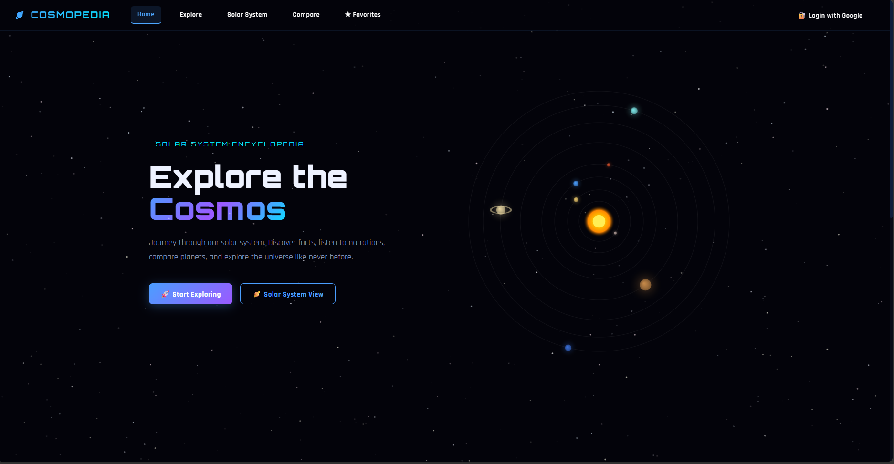
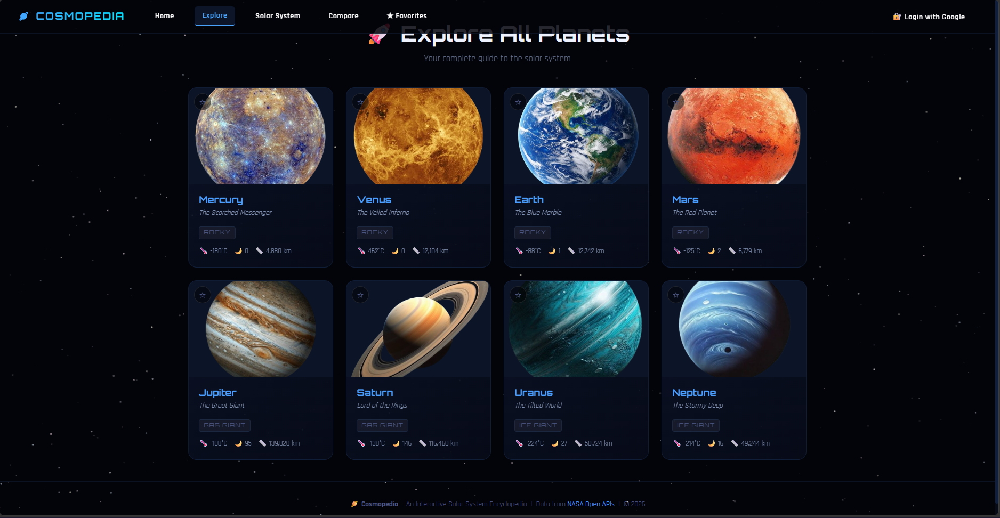
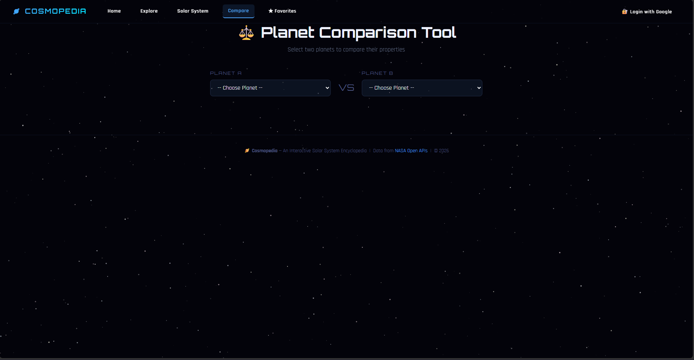
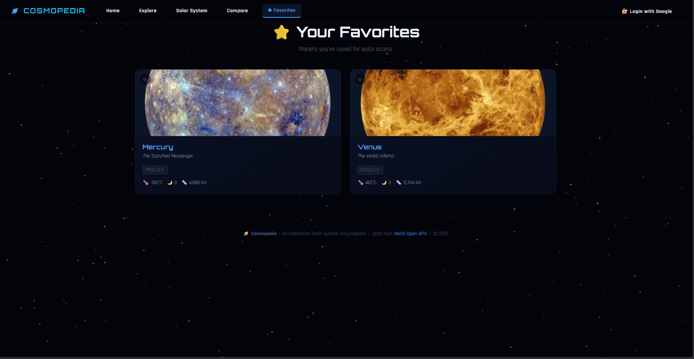

# 🚀 COSMOPEDIA — Interactive Solar System Explorer

An immersive, interactive **Solar System Encyclopedia** built with **React + Vite**.
Explore planets, compare stats, listen to narrations, and interact with a dynamic solar system — all in one place.

> 🌌 Futuristic space UI with smooth animations and clean design.

---

## ✨ Features

### 🌍 Core Experience
- 🪐 Explore all 8 planets with rich visuals
- 🔎 Search & filter planets instantly
- 📄 Detailed planet pages with stats & descriptions

### 🌌 Interactive Elements
- 🌞 Interactive Solar System (canvas-based)
- 🖱️ Click planets to navigate
- 🎧 Audio narration for each planet

### ⚖️ Comparison & Personalization
- ⚖️ Compare two planets side-by-side
- ⭐ Add/remove favorites
- 💾 Favorites stored using LocalStorage

### 🎨 UI/UX
- 🌑 Dark space-themed design
- ✨ Glow effects & gradients
- 📱 Responsive layout
- 🧩 Modular React components

---

## 🚀 Getting Started

### 1️⃣ Clone the repo
```bash
git clone https://github.com/RajTib/cosmopedia.git
cd cosmopedia
```

### 2️⃣ Install dependencies
```bash
npm install
```

### 3️⃣ Run the app
```bash
npm run dev
```

## 📸 Screenshots

### 🌌 Home Page


### 🪐 Explore Page


### 🌍 Planet Page


### ⚖️ Comparison Tool


### ⭐ Favorites Page


---

## 🛠️ Tech Stack

| Technology        | Usage                  |
| ----------------- | ---------------------- |
| React (Vite)      | Frontend framework     |
| React Router      | Routing                |
| CSS3              | Styling & animations   |
| HTML5 Canvas      | Solar system rendering |
| JavaScript (ES6+) | Logic                  |
| LocalStorage      | Favorites persistence  |

---

## 🎨 Design Highlights

- 🌌 Space-inspired dark theme
- 💡 Glow effects for planets
- 🧱 Clean card-based layout
- 🎯 Interactive orbital system
- 🎧 Styled audio player

---

## 👤 Author

Made with 🚀 by **Raj**

---

## 📄 License

This project is open source under the **MIT License**
